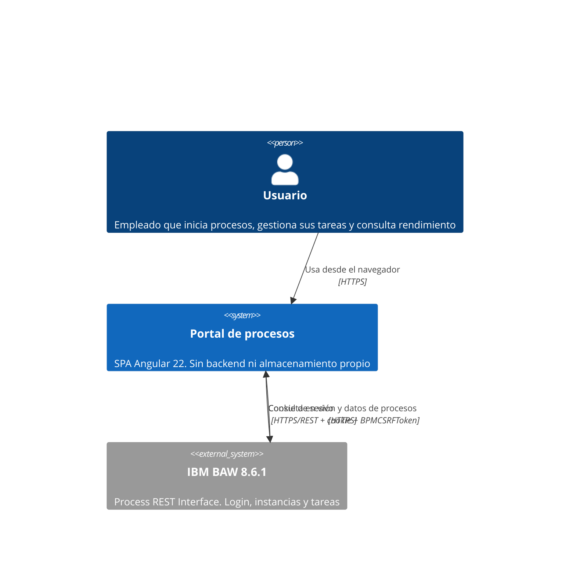

# DG-01: Contexto de la capability

- **Tipo:** Contexto (C4)
- **Alcance:** Actores y sistemas que intervienen. No cubre el detalle interno del frontend (ver [DG-02](DG-02-componentes-frontend.md)) ni la arquitectura interna de BAW.

**Notas**

- **No hay backend propio ni base de datos:** el navegador habla directamente con BAW. El portal solo retiene `csrf_token` y `username` en almacenamiento efímero ([MD-01](../models/MD-01-sesion-credenciales.md)).
- La disponibilidad del portal es la de BAW (NFR-004, riesgo R-04): no hay caché ni degradación offline.
- En desarrollo la comunicación pasa por el proxy del frontend; en producción cruzaría orígenes. Ver [Observaciones](../README.md#observaciones), punto 8.
