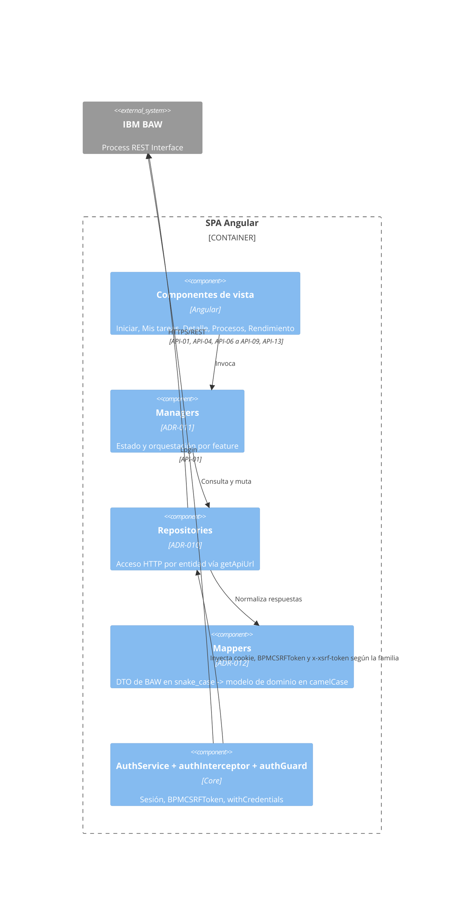

# DG-02: Componentes del frontend

- **Tipo:** Componentes (C4)
- **Alcance:** Capas del frontend que materializan esta capability, conforme a los estándares del repositorio `frontend` (ADR-010 Repository, ADR-011 Manager, ADR-012 Mapper). No cubre componentes de presentación individuales ni el sistema de diseño.

**Notas**

- Los repositories se reparten por **entidad**, no por familia de API: uno para tareas ([API-13](../apis/API-017-tareas.md#put-rest-bpm-wle-tasks) listado, más [API-06](../apis/API-017-tareas.md#get-bpm-user-tasks-task-id) … [API-08](../apis/API-017-tareas.md#post-bpm-user-tasks-task-id-complete) detalle, reclamo y completado) y otro para instancias de proceso ([API-04](../apis/API-016-procesos.md#post-bpm-processes), [API-09](../apis/API-016-procesos.md#get-bpm-processes)). Las URLs se componen **solo** con `getApiUrl(path)` y el path empieza sin barra inicial (`rest/bpm/wle/v1/tasks`, `bpm/user-tasks/{id}`) para que el proxy funcione — el cual debe cubrir `/rest` además de `/bpm` (`api/CR-002` de ADR-015).
- **El repository de tareas habla hoy con dos familias a la vez**: WLE para buscar y `/bpm/` para operar sobre una tarea concreta. `api/CR-001` de ADR-015 exige que también lo segundo pase a WLE; mientras no haya contrato validado para ello, esa convivencia es una brecha conocida ([Observaciones](../README.md#observaciones), punto 14), no el diseño objetivo.
- Los mappers son funciones puras sin DI ni E/S y **absorben la diferencia entre los dos contratos de cable de [MD-04](../models/MD-04-tarea.md)**: el del listado lee claves `UPPER_SNAKE_CASE` con punto (`item['TASK.TKIID']`) y el del detalle lee `snake_case`, y ambos producen el **mismo** modelo de dominio. Calculan además los campos derivados — `slaStatus` e `isClaimedByCurrentUser` de [MD-04](../models/MD-04-tarea.md), `teamName`, `isActive` de [MD-03](../models/MD-03-instancia-proceso.md), `isSessionExpired` de [MD-11](../models/MD-11-error-api-baw.md) — y renombran `stats.onTrack` a `onTime` ([MD-05](../models/MD-05-resumen-sla-lista-tareas.md)).
- **Los agregados de SLA ya no se calculan en el cliente.** El manager de «Mis tareas» los recibe del servidor en la misma respuesta del listado; no hay que recorrer `items` para contarlos.
- El motor de formulario dinámico ([MD-06](../models/MD-06-campo-formulario-dinamico.md)) vive en la feature de tareas, no en `core`: es específico de esta capability. La **configuración por proceso** que necesitan [MD-06](../models/MD-06-campo-formulario-dinamico.md) y [MD-07](../models/MD-07-accion-tarea.md) debería vivir junto a él, no dispersa.
- Las features no se importan entre sí (regla `no-feature-to-feature`); lo compartido pasa por `shared/contracts/`.
