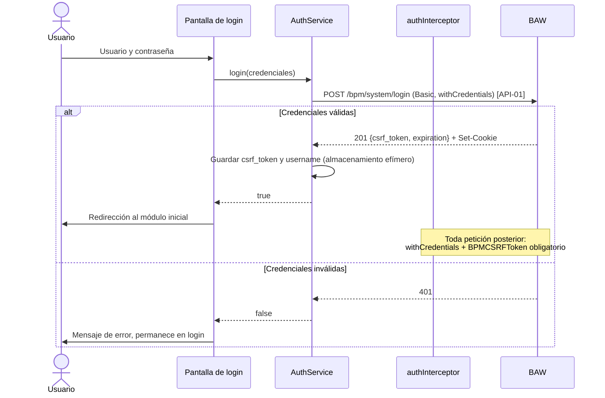

# FL-01: Autenticación y ciclo de vida de la sesión

- **Disparador:** El usuario envía el formulario de login, o un usuario sin sesión intenta entrar a un módulo protegido.
- **Actores / componentes:** Usuario, componente de login, `AuthService`, `authInterceptor`, `authGuard`, BAW.
- **Resultado:** Sesión válida y acceso a los módulos, o permanencia en `/signin` con mensaje de error.
- **Estado de validación: Confirmado** (contrato OpenAPI + implementación existente en `frontend`).

**Pasos**

1. El usuario introduce sus credenciales.
2. `AuthService` invoca [API-01](../apis/API-015-autenticacion.md#post-bpm-system-login) con `Authorization: Basic` y `withCredentials: true`.
3. BAW responde **201**, emite la cookie de sesión (la credencial real) y devuelve el `csrf_token`.
4. `AuthService` guarda `csrf_token` y `username` en almacenamiento efímero ([MD-01](../models/MD-01-sesion-credenciales.md)); el portal **no** persiste datos propios en ningún backend.
5. `authInterceptor` añade `withCredentials: true` y la cabecera `BPMCSRFToken` a **toda** petición posterior — sin ella BAW responde 403 (verificado).
6. `authGuard` deja pasar a los módulos protegidos mientras haya sesión; si no, redirige a `/signin` (FR-010).
7. Al cerrar sesión (FR-011), el portal descarta el estado local y navega a `/signin`, **sin llamar a BAW** ([API-02](../apis/API-015-autenticacion.md#no-existe-cerrar-sesion)).

**Manejo de errores**

| Paso | Error posible                  | Comportamiento esperado                                                                          |
| ---- | ------------------------------ | ------------------------------------------------------------------------------------------------ |
| 2    | BAW inaccesible (riesgo R-04)  | Mensaje de indisponibilidad con reintento; no se marca sesión iniciada                           |
| 3    | 401 por credenciales inválidas | Error en el formulario; las credenciales **no** se conservan                                     |
| 5    | Token expirado (máximo 7200 s) | Sesión expirada → [FL-02](FL-02-expiracion-sesion-durante-uso.md); no se renueva silenciosamente |
| 7    | —                              | No hay llamada que pueda fallar: el cierre de sesión es local                                    |
