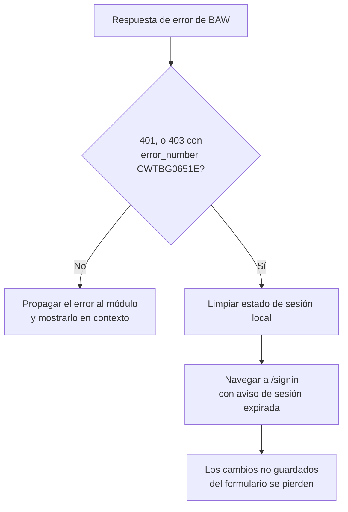

# FL-02: Expiración de sesión durante el uso

- **Disparador:** Una llamada a BAW responde con sesión o token inválidos, estando el usuario dentro del portal.
- **Actores / componentes:** Usuario, `authInterceptor`, `AuthService`, router.
- **Resultado:** El usuario acaba en `/signin` con aviso; los cambios no guardados **se pierden**.
- **Estado de validación: Confirmado** — la condición de disparo quedó resuelta con la verificación en vivo.

**Pasos**

1. El usuario opera normalmente (p. ej. editando el formulario de una tarea).
2. Una llamada falla; `authInterceptor` evalúa `isSessionExpired` ([MD-11](../models/MD-11-error-api-baw.md)): `401`, o `403` con `error_number = CWTBG0651E`.
3. Si **no** lo es (p. ej. un 403 de autorización sobre un recurso concreto), el error se propaga al módulo y se muestra en contexto, sin sacar al usuario del portal.
4. Si **sí** lo es, se limpia el estado local y se navega a `/signin` con aviso.
5. Los cambios no guardados se pierden: comportamiento **esperado y aceptado** por el criterio de verificación de NFR-001.

**Manejo de errores**

| Paso | Error posible                                      | Comportamiento esperado                                                                                           |
| ---- | -------------------------------------------------- | ----------------------------------------------------------------------------------------------------------------- |
| 2    | Un 403 de autorización se confunde con uno de CSRF | Discriminar por `error_number`, **no solo por el código HTTP**: ambos casos usan 403 y solo el mensaje los separa |
| 4    | Varias peticiones en vuelo fallan a la vez         | Una sola redirección: limpieza y navegación idempotentes, sin encadenar avisos                                    |

> **No hay renovación silenciosa.** El portal no conserva las credenciales, así que no puede re-autenticar por su cuenta ni reintentar lo fallido tras un nuevo login. Con el techo de 7200 s de [MD-01](../models/MD-01-sesion-credenciales.md), este flujo se dispara al menos una vez por jornada: merece un aviso cuidado, no un mensaje genérico.
