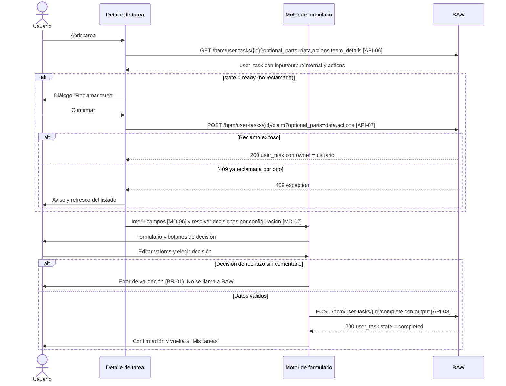

# FL-03: Reclamar y completar una tarea con formulario dinámico

- **Disparador:** El usuario pulsa «Abrir tarea» en «Mis tareas».
- **Actores / componentes:** Usuario, detalle de tarea, motor de formulario dinámico, BAW.
- **Resultado:** Tarea completada en BAW con la decisión elegida, o permanencia en el detalle con el error explicado.
- **Estado de validación: Confirmado** en los contratos; depende de la configuración por proceso de [MD-06](../models/MD-06-campo-formulario-dinamico.md) y [MD-07](../models/MD-07-accion-tarea.md).

**Pasos**

1. El detalle invoca [API-06](../apis/API-017-tareas.md#get-bpm-user-tasks-task-id) con `optional_parts=data,actions,team_details`.
2. Si `state = ready`, se presenta el diálogo de reclamo — **siempre**, sin opción de recordar la preferencia (el portal no persiste datos propios).
3. Al confirmar se invoca [API-07](../apis/API-017-tareas.md#post-bpm-user-tasks-task-id-claim) pidiendo `data,actions`, con lo que la respuesta ya trae todo y evita repetir [API-06](../apis/API-017-tareas.md#get-bpm-user-tasks-task-id).
4. El motor infiere los campos desde `data_object` ([MD-06](../models/MD-06-campo-formulario-dinamico.md)) y resuelve los botones de decisión desde la configuración del proceso ([MD-07](../models/MD-07-accion-tarea.md)), habilitándolos solo si `actions` incluye `complete`.
5. El usuario revisa, edita y elige una decisión.
6. El portal valida BR-01 **antes de llamar**.
7. Se invoca [API-08](../apis/API-017-tareas.md#post-bpm-user-tasks-task-id-complete) con `output`; al completarse, vuelta a «Mis tareas».

**Manejo de errores**

| Paso | Error posible                                   | Comportamiento esperado                                                                                           |
| ---- | ----------------------------------------------- | ----------------------------------------------------------------------------------------------------------------- |
| 1    | 404: tarea ya completada por otro               | Aviso y vuelta al listado refrescado                                                                              |
| 1    | 403: sin autorización sobre la tarea            | Aviso y vuelta al listado; **no** confundir con sesión expirada ([FL-02](FL-02-expiracion-sesion-durante-uso.md)) |
| 4    | Variable de tipo `object`/`array`, no inferible | Renderizar de solo lectura y **no bloquear** el resto del formulario; registrar el caso (riesgo R-03)             |
| 4    | El proceso no tiene configuración de decisiones | No se pueden pintar botones de negocio; degradar a un «Completar» genérico y reportarlo                           |
| 3    | 409 conflicto de reclamo                        | Caso normal: aviso claro y refresco del listado                                                                   |
| 5    | Sesión expira mientras se edita                 | [FL-02](FL-02-expiracion-sesion-durante-uso.md): se pierden los cambios (aceptado por NFR-001)                    |
| 7    | 400 por datos inválidos                         | Mostrar `error_message` de BAW junto al formulario **conservando lo capturado**; no cerrar la vista               |
| 7    | 403: la tarea dejó de estar asignada            | Aviso y vuelta al listado                                                                                         |
