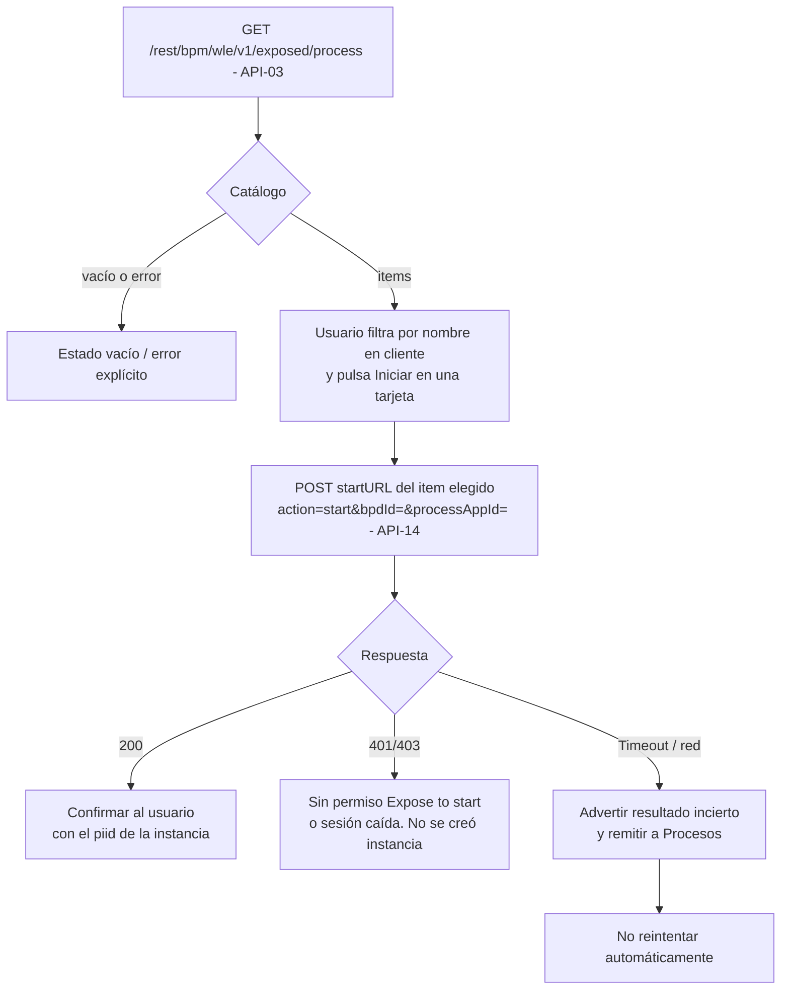

# FL-04: Iniciar una instancia de proceso

- **Disparador:** El usuario pulsa el botón de inicio en una tarjeta de «Iniciar».
- **Actores / componentes:** Usuario, pantalla «Iniciar», BAW (familia WLE).
- **Resultado:** Instancia creada y confirmada, o error explicado sin instancia creada.
- **Estado de validación: Confirmado** de punta a punta — catálogo ([API-03](../apis/API-016-procesos.md#get-rest-bpm-wle-exposed-process)) y arranque ([API-14](../apis/API-016-procesos.md#post-rest-bpm-wle-process)), ambos con ejecución real el 2026-09-15.

**Pasos**

1. La pantalla «Iniciar» obtiene el catálogo de procesos arrancables vía [API-03](../apis/API-016-procesos.md#get-rest-bpm-wle-exposed-process).
2. El usuario filtra por nombre (en cliente) y pulsa el botón de inicio.
3. El portal invoca [API-14](../apis/API-016-procesos.md#post-rest-bpm-wle-process) usando el `startURL` que trae el propio elemento del catálogo (`bpdId`/`processAppId`, [MD-02](../models/MD-02-proceso-iniciable.md)) — no reconstruirlo a mano.
4. Ante 200, se confirma indicando el `piid` de la instancia creada.

**Manejo de errores**

| Paso | Error posible                                                                       | Comportamiento esperado                                                                                                                                                                                                         |
| ---- | ----------------------------------------------------------------------------------- | ------------------------------------------------------------------------------------------------------------------------------------------------------------------------------------------------------------------------------- |
| 1    | Catálogo vacío o falla su carga                                                     | Estado vacío o de error explícito, distinto entre sí — no dejar la vista en blanco                                                                                                                                              |
| 3    | **401/403: sesión caída o el usuario no tiene _Expose to start_ para este proceso** | Mensaje claro de falta de permiso o sesión expirada; no se creó instancia. **Sin provocar en vivo todavía** — ver [API-14](../apis/API-016-procesos.md#post-rest-bpm-wle-process)                                               |
| 3    | **Timeout o corte de red**                                                          | Advertir que el resultado es **incierto** y remitir a «Procesos» para verificar. **No reintentar automáticamente**: [API-14](../apis/API-016-procesos.md#post-rest-bpm-wle-process) no es idempotente y duplicaría la instancia |
| 3    | Sesión expirada                                                                     | [FL-02](FL-02-expiracion-sesion-durante-uso.md)                                                                                                                                                                                 |
