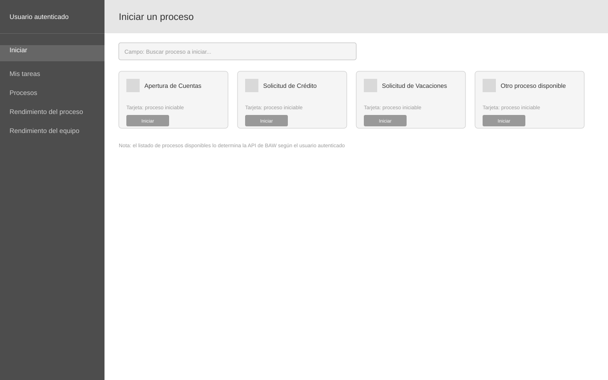

# Wireframe: Iniciar

**SRS:** [SRS-001: Portal de administración de procesos IBM BAW](../../README.md)
**Estado de revisión:** Aprobado

<!-- wireframe:review-status=approved -->

## Objetivo de la pantalla

Permitir al usuario autenticado ver los procesos disponibles para él y arrancar una nueva instancia.

**Requisitos relacionados:** FR-001

## Estructura

## Componentes clave

- Barra lateral de navegación: acceso a Iniciar, Mis tareas, Procesos, Rendimiento del proceso, Rendimiento del equipo
- Campo de búsqueda: filtra los procesos disponibles por nombre
- Tarjeta de proceso: nombre, ícono y botón para iniciar una nueva instancia

## Historial de revisión

| Fecha | Observación del usuario | Resuelto en |
| ----- | ----------------------- | ----------- |
|       |                         |             |
