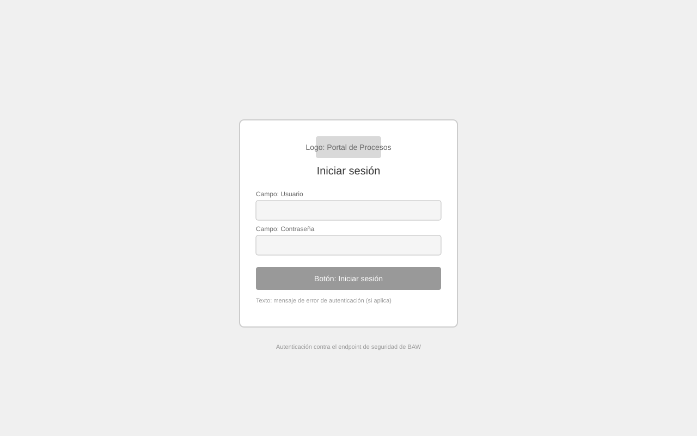

# Wireframe: Login

**SRS:** [SRS-001: Portal de administración de procesos IBM BAW](../../README.md)
**Estado de revisión:** Aprobado

<!-- wireframe:review-status=approved -->

## Objetivo de la pantalla

Autenticar al usuario contra el mecanismo de seguridad de BAW antes de permitir el acceso a cualquier módulo del portal.

**Requisitos relacionados:** FR-010

## Estructura

## Componentes clave

- Campo Usuario: entrada de texto libre
- Campo Contraseña: entrada enmascarada
- Botón Iniciar sesión: envía las credenciales al endpoint de login de BAW
- Mensaje de error: se muestra si la autenticación falla

## Historial de revisión

| Fecha | Observación del usuario | Resuelto en |
| ----- | ----------------------- | ----------- |
|       |                         |             |
