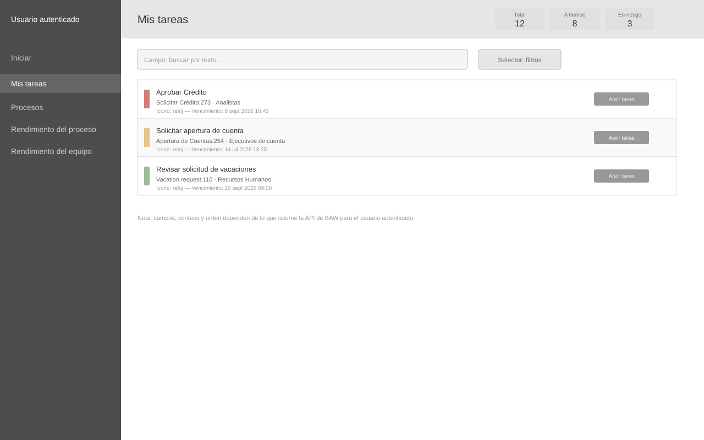

# Wireframe: Mis tareas

**SRS:** [SRS-001: Portal de administración de procesos IBM BAW](../../README.md)
**Estado de revisión:** Aprobado

<!-- wireframe:review-status=approved -->

## Objetivo de la pantalla

Mostrar al usuario autenticado las tareas que tiene asignadas, con su estado de SLA, y permitirle abrir una para completarla.

**Requisitos relacionados:** FR-002, FR-009

## Estructura

## Componentes clave

- Contadores de resumen: Total, A tiempo, En riesgo, Vencidas
- Campo de búsqueda y selector de filtros
- Fila de tarea: nombre de la tarea, instancia de proceso, equipo, vencimiento, indicador visual de estado SLA
- Botón "Abrir tarea": navega al detalle de la tarea (ver wireframe `tarea-detalle`)

## Historial de revisión

| Fecha | Observación del usuario | Resuelto en |
| ----- | ----------------------- | ----------- |
|       |                         |             |
