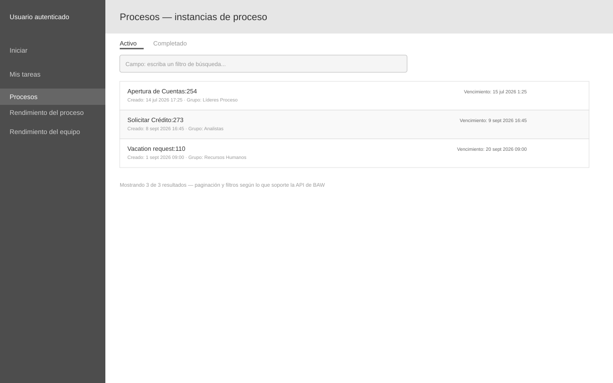

# Wireframe: Procesos

**SRS:** [SRS-001: Portal de administración de procesos IBM BAW](../../README.md)
**Estado de revisión:** Aprobado

<!-- wireframe:review-status=approved -->

## Objetivo de la pantalla

Mostrar el listado de instancias de proceso en ejecución (y completadas), con búsqueda y filtro por estado.

**Requisitos relacionados:** FR-006, FR-009

## Estructura

## Componentes clave

- Pestañas Activo / Completado
- Campo de búsqueda por texto
- Fila de instancia: nombre + identificador, fecha de creación, grupo responsable, vencimiento

## Historial de revisión

| Fecha | Observación del usuario | Resuelto en |
| ----- | ----------------------- | ----------- |
|       |                         |             |
