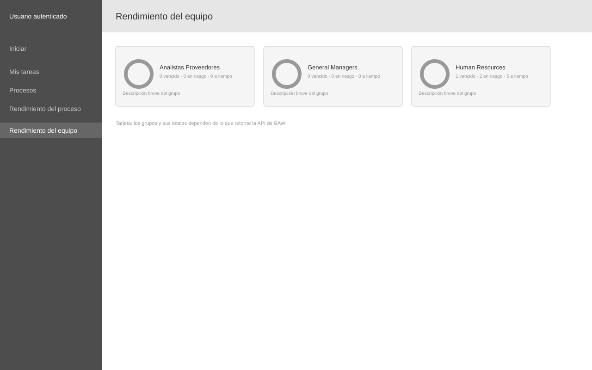

# Wireframe: Rendimiento del equipo

**SRS:** [SRS-001: Portal de administración de procesos IBM BAW](../../README.md)
**Estado de revisión:** Aprobado

<!-- wireframe:review-status=approved -->

## Objetivo de la pantalla

Mostrar, por grupo/equipo, el estado agregado de los procesos con totales de instancias vencidas, en riesgo y a tiempo.

**Requisitos relacionados:** FR-008

## Estructura

## Componentes clave

- Tarjeta por grupo: nombre, gráfico circular de estado, conteos de vencido/en riesgo/a tiempo, descripción breve del grupo

## Historial de revisión

| Fecha | Observación del usuario | Resuelto en |
| ----- | ----------------------- | ----------- |
|       |                         |             |
