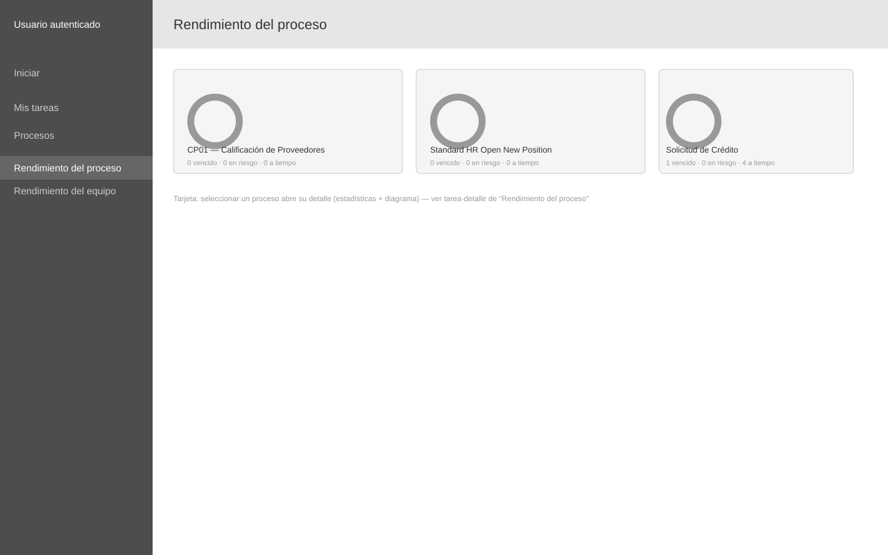

# Wireframe: Rendimiento del proceso

**SRS:** [SRS-001: Portal de administración de procesos IBM BAW](../../README.md)
**Estado de revisión:** Aprobado

<!-- wireframe:review-status=approved -->

## Objetivo de la pantalla

Mostrar indicadores agregados por tipo de proceso (instancias en curso, duración promedio, tasa de renovación) y, al seleccionar uno, su diagrama con el estado de tareas superpuesto.

**Requisitos relacionados:** FR-007

## Estructura

## Componentes clave

- Tarjeta por proceso: nombre, gráfico circular de estado, conteos de vencido/en riesgo/a tiempo
- Al seleccionar una tarjeta, navega al detalle del proceso

## Estados de la pantalla

- Detalle de un proceso seleccionado (pestañas Visión general / Diagrama, estadísticas, instancias en curso) — ver [`rendimiento-proceso-detalle.svg`](./rendimiento-proceso-detalle.svg)

## Historial de revisión

| Fecha | Observación del usuario | Resuelto en |
| ----- | ----------------------- | ----------- |
|       |                         |             |
