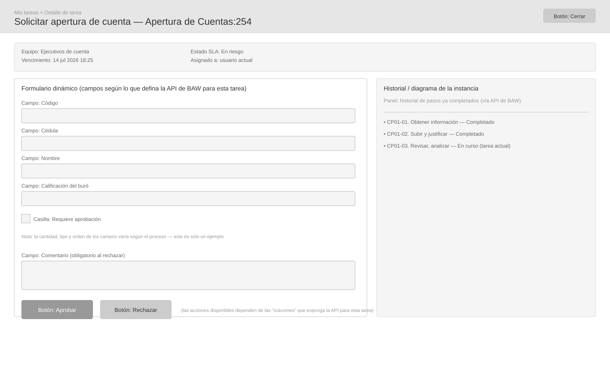

# Wireframe: Detalle de tarea

**SRS:** [SRS-001: Portal de administración de procesos IBM BAW](../../README.md)
**Estado de revisión:** Aprobado

<!-- wireframe:review-status=approved -->

## Objetivo de la pantalla

Permitir al usuario revisar y, si aplica, reclamar una tarea, ver/editar los datos propios del proceso mediante un formulario renderizado dinámicamente según la API de BAW, y completarla ejecutando una de las acciones ("outcomes") disponibles.

**Requisitos relacionados:** FR-003, FR-004, FR-005

## Estructura

## Componentes clave

- Panel de información de la tarea: equipo, vencimiento, estado SLA, asignado a
- Formulario dinámico: campos generados según los datos que retorne la API de BAW para esa tarea (el ejemplo muestra los campos de "Apertura de cuentas"; varían por proceso)
- Panel de historial/diagrama: pasos ya completados de la instancia
- Campo de comentario: obligatorio al menos al rechazar
- Botones de acción dinámicos: uno por cada "outcome" que la API exponga para la tarea (p. ej. Aprobar, Rechazar)

## Estados de la pantalla

- Tarea no reclamada: antes de mostrar el formulario, se presenta el diálogo de confirmación de reclamo — ver [`tarea-detalle-reclamar.svg`](./tarea-detalle-reclamar.svg)

## Historial de revisión

| Fecha      | Observación del usuario                                                                                                                                                                                 | Resuelto en                                                                                  |
| ---------- | ------------------------------------------------------------------------------------------------------------------------------------------------------------------------------------------------------- | -------------------------------------------------------------------------------------------- |
| 2026-09-11 | Quitar la casilla "No volver a mostrarme este mensaje" del diálogo de reclamo (detectada en validación Ola 3): el portal no almacena datos propios, así que esa preferencia no tiene dónde persistirse. | `tarea-detalle-reclamar.svg` — diálogo siempre se muestra al reclamar una tarea no asignada. |
