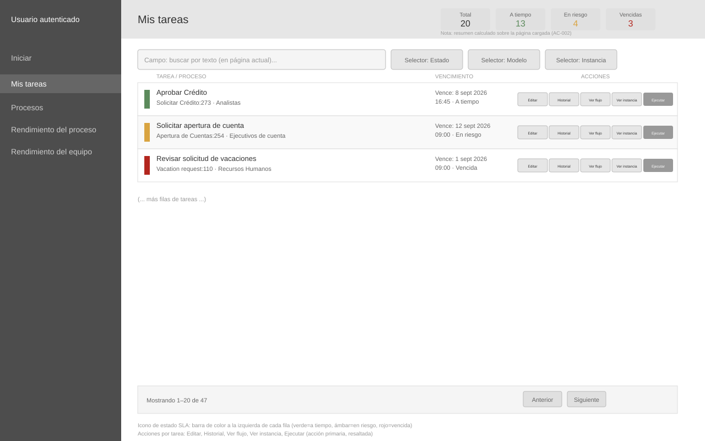
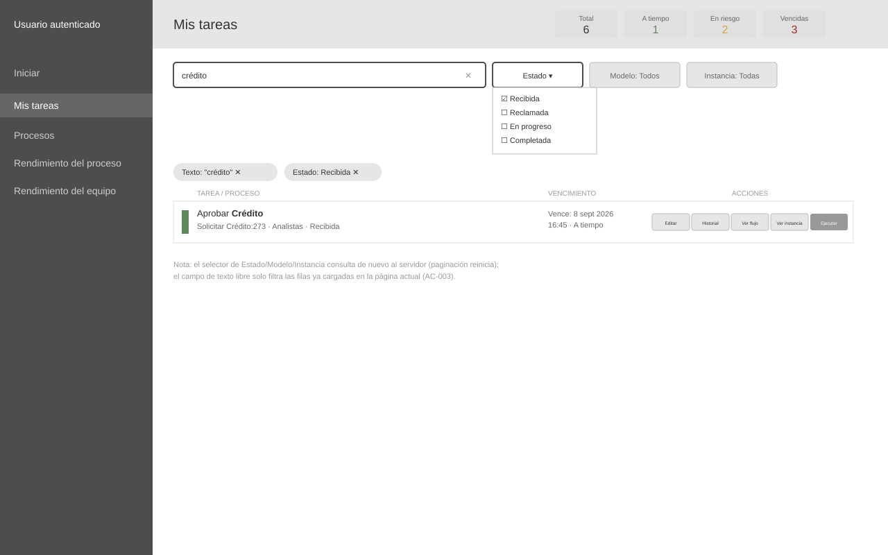
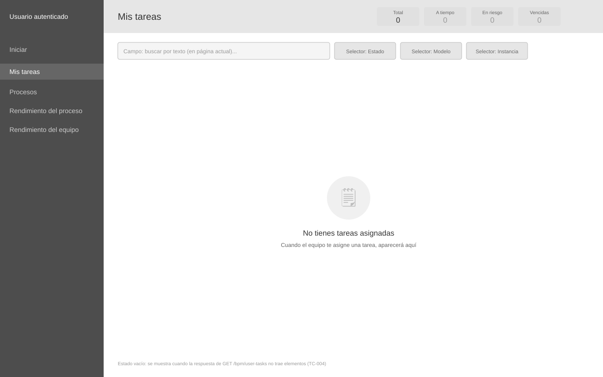
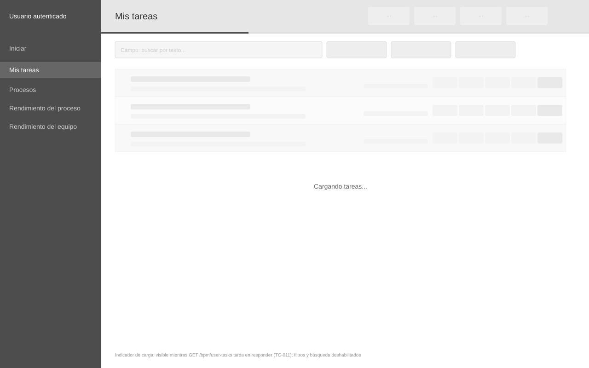
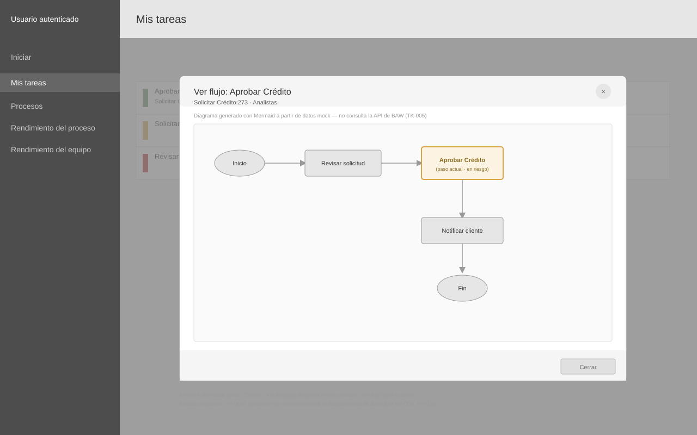

# Wireframes: Mis tareas — listado y SLA

**Historia:** [US-003: Mis tareas — listado y SLA](../README.md)
**Estado de revisión:** Propuesto
**Base:** Extiende el [wireframe aprobado](../../../../specs/requirements/SRS-001-portal-procesos-baw/assets/wireframes/mis-tareas.md) del SRS de origen con los estados que introducen los criterios de aceptación de esta historia.
**Propuesta de distribución responsiva:** [prototipo interactivo](https://claude.ai/code/artifact/04f111c6-c5fc-4b0c-b52a-c8acabf6fea9) — tabla en escritorio / tarjetas en móvil, resumen de SLA como filtros rápidos, panel de filtros tipo bottom sheet en móvil. Referencia para actualizar estos SVG cuando se apruebe.

<!-- wireframe:review-status=proposed -->

## Objetivo

Detallar cómo se ve la pantalla "Mis tareas" en los estados relevantes para AC-001 a AC-004: listado con resumen de SLA y paginación, filtros de servidor + búsqueda de cliente aplicados, listado vacío y carga lenta.

## Pantallas

### 1. Listado base con resumen SLA y paginación

**Requisitos relacionados:** AC-001, AC-002, AC-004

- Resumen de 4 contadores (Total, A tiempo, En riesgo, Vencidas) calculado sobre la página cargada.
- Cada fila muestra nombre de tarea, instancia de proceso, equipo, vencimiento y estado de SLA (barra de color: verde=a tiempo, ámbar=en riesgo, rojo=vencida).
- Acciones por tarea: **Editar**, **Historial**, **Ver flujo**, **Ver instancia** y **Ejecutar** (acción primaria, resaltada).
- Pie de página con paginación de servidor (`offset`/`size`), no carga todas las tareas de una vez.

### 2. Filtros de servidor + búsqueda de cliente aplicados

**Requisitos relacionados:** AC-003

- Selectores de Estado, Modelo de proceso e Instancia: cada cambio vuelve a consultar al servidor y reinicia la paginación.
- Campo de texto libre: filtra únicamente sobre las filas ya cargadas en la página actual (no dispara una llamada nueva).
- Chips de filtros activos, con opción de quitarlos individualmente.

### 3. Listado vacío

**Requisitos relacionados:** AC-001
**Caso de prueba:** [TC-004](../test-cases/TC-004-listado-vacio-sin-tareas-error.md)

- Se muestra cuando `GET /bpm/user-tasks` no retorna tareas para el usuario autenticado.
- Contadores de resumen en cero; filtros y búsqueda permanecen visibles pero sin resultados que mostrar.

### 4. Indicador de carga (respuesta lenta)

**Requisitos relacionados:** AC-004
**Caso de prueba:** [TC-011](../test-cases/TC-011-indicador-carga-respuesta-lenta-limite.md)

- Barra de progreso bajo la barra superior y filas en skeleton mientras la respuesta tarda en llegar.
- Filtros y búsqueda deshabilitados durante la carga para evitar solicitudes concurrentes.

### 5. Modal "Ver flujo" (mock)

**Tarea relacionada:** [TK-005](../TK-005-modal-ver-flujo-mermaid-mock.md) — fuera del alcance de AC-001 a AC-004; propuesto por el agente a pedido del usuario, sin AC de esta historia asociado.

- Se abre desde la acción "Ver flujo" del menú contextual de cada fila, ya visible en la Pantalla 1 (`TASK_ROW_ACTIONS`, hasta ahora deshabilitada).
- El diagrama se renderiza con Mermaid a partir de datos mock del proceso; no consulta la API de diagrama de BAW (pendiente y bloqueante en [US-005](../../US-005-rendimiento-proceso/README.md), AC-002).
- El paso actual de la tarea queda resaltado dentro del diagrama.
- El cierre del modal (botón "Cerrar", ✕ o Escape) devuelve el foco al botón "Ver flujo" que lo abrió.

## Historial de revisión

| Fecha | Observación del usuario | Resuelto en |
| ----- | ----------------------- | ----------- |
|       |                         |             |
